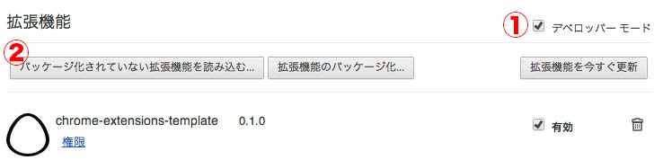

## Chromeエクステンションテンプレート
=========================

このエクステンションはChromeエクステンションを雛形化しており

 * __JavaScriptは多少なり書けるけどエクステンションを作る仕組みが分からない__
 * __自分用の便利なエクステンションを一つに纏めておきたい__

という方々を対象としています

#### 1. 導入手順

 * このリポジトリをzipで落とす
 * Chromeブラウザから``chrome://extensions/``にアクセス
 * デベロッパーモードにチェックを入れる
 * パッケージ化されていない拡張機能を取り込むを選択 → インポート

 

あとは自動化したい処理をJSで記述すればOKです。

#### 2. 編集が必要なファイル

|  |  | 備考 |
|:-----------|:-----------|:-----------|
| popup/ |  |  |
| ⌊ | popup.html | 作成したJS名を追記してください |
| src/ |  |  |
| ⌊ | action/ | ここにJSファイルを追加してください |

#### 3. popup.htmlの編集

````
<div id="jsiMenuList" class="menu-list running">
<!-- data-actionにjsのファイル名を設定 -->
<a class="jscMenu menu menu-play" data-action="hoge">hogeの処理</a>
</div>
````
